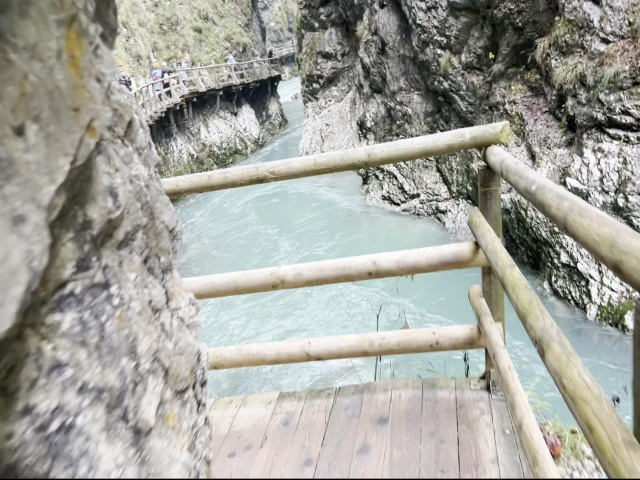
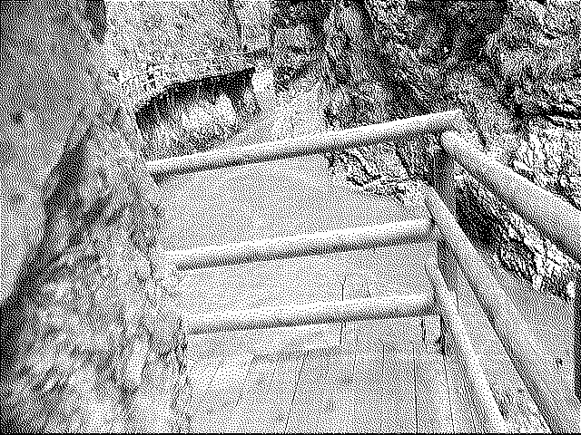

# video-dither

video-dither is a command line tool for creating video files with 
[1-bit](https://en.wikipedia.org/wiki/Binary_image)
[dithered](https://en.wikipedia.org/wiki/Dither)
look. The tool takes any video file, optionally downscales it and
converts each frame into a 1-bit dithered image.

Here is an example input video frame:



And here is the corresponding output frame:



## Compilation

OpenCV library (with C++ headers) version 4.10 is required for compilation.

```
mkdir build
cd build
cmake ..
make
```

## Usage

The following command reads input.avi file, resizes it to 640x480 and produces
output in output.avi.

```
video-dither -h 640 -w 480 input.avi output.avi
```

If -h or -w flags are not specified, the output matches the resolution of the
input file. Currently, the only supported output format is
[Motion JPEG](https://en.wikipedia.org/wiki/Motion_JPEG). Possible audio channels are
not copied to the output video.

The tool uses all CPU cores to downscale and dither frames concurrently.
